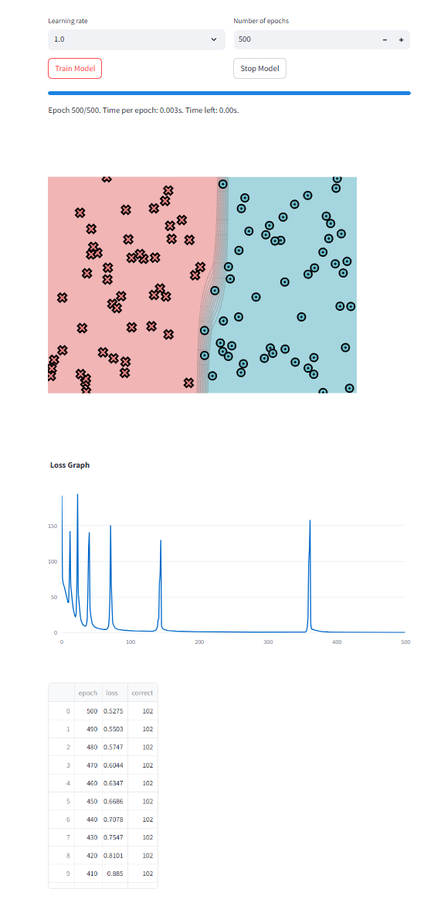
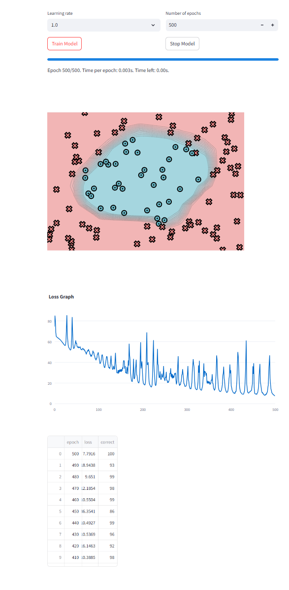
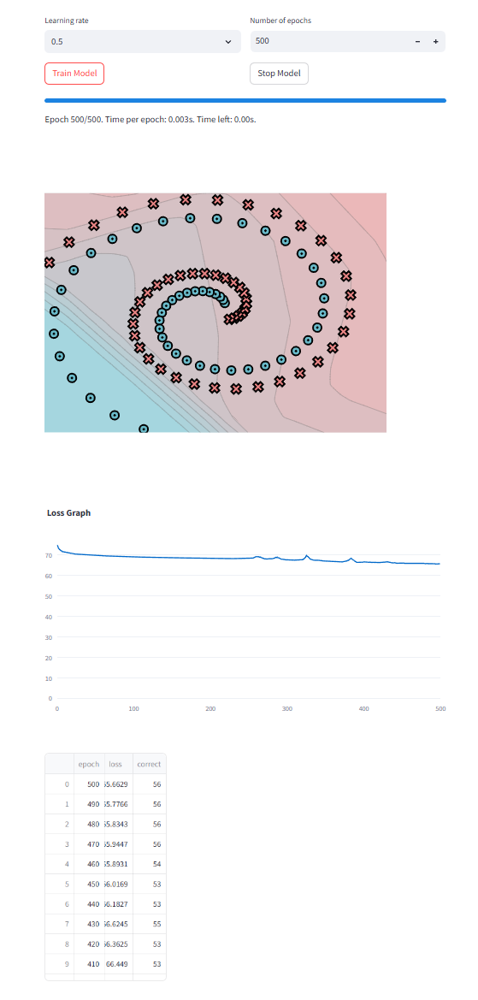
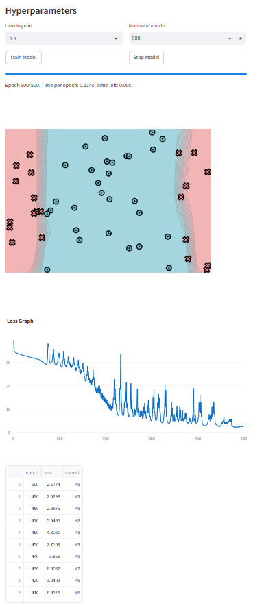
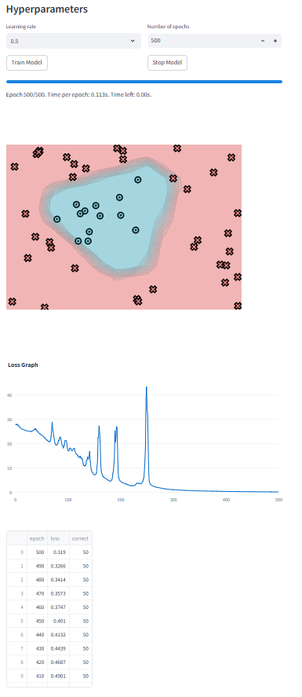
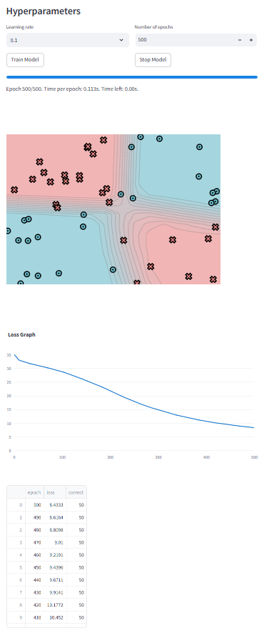

# MiniTorch
My completion of [MiniTorch](https://github.com/minitorch/minitorch), a DIY teaching library made by [Sasha Rush](https://www.youtube.com/@srush_nlp) for machine Learning who wish to learn about the internal concepts underlying deep learning systems. It is a pure Python re-implementation of the [PyTorch](https://pytorch.org/) and was designed to be simple, easy-to-read, tested, and incremental. The final library can run Torch code.

# Documentation

Documentation can be accessed [here](https://minitorch.github.io/)

# Progression

- [x] Module 0 : Fundamentals
  - [x] Task 0.1 : Operators
  - [x] Task 0.2 : Testing and Debugging
  - [x] Task 0.3 : Functional Python
  - [x] Task 0.4 : Modules
  - [x] Task 0.5 : Visualization
- [x] Module 1 : Autodiff
  - [x] Task 1.1 : Numerical Derivatives
  - [x] Task 1.2 : Scalars
  - [x] Task 1.3 : Chain Rule
  - [x] Task 1.4 : Backpropagation
  - [x] Task 1.5 : Training
- [ ] Module 2 : Tensors
  - [ ] Task 2.1 : Tensor Data-Indexing
  - [ ] Task 2.2 : Tensor Broadcasting
  - [ ] Task 2.3 : Tensor Operations
  - [ ] Task 2.4 : Gradients and Autograd
  - [ ] Task 2.5 : Training
- [ ] Module 3 : Efficiency
  - [ ] Task 3.1 : Parallelization
  - [ ] Task 3.2 : Matrix Multiplication
  - [ ] Task 3.3 : CUDA Operations
  - [ ] Task 3.4 : CUDA Matrix Multiplication
  - [ ] Task 3.5 : Training
- [ ] Module 4 : Networks
  - [ ] Task 4.1 : 1D Convolution
  - [ ] Task 4.2 : 2D Convolution
  - [ ] Task 4.3 : Pooling
  - [ ] Task 4.4 : Softmax and Dropout
  - [ ] Task 4.5 : Training an Image Classifier

# Results
## Module 0
Result of the same network built with Pytorch on 3 different datasets : simple, circle and spiral

    
    
    

## Module 1
Result of the same network built with MiniTorch's scalars on 3 different datasets : split, circle and xor

    
    
    

